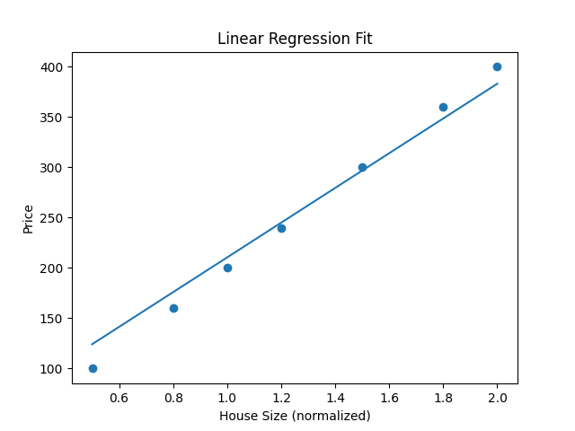
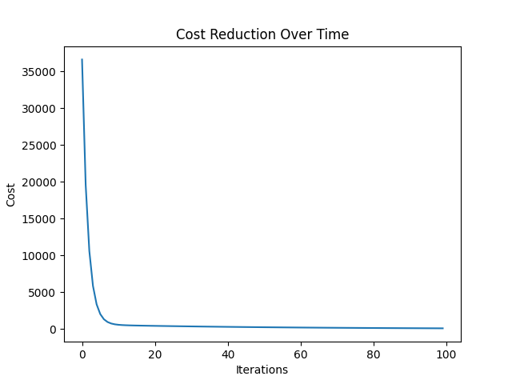

# Linear-regression-from-scratch
Linear Regression implemented from scratch using Gradient Descent in Python
## 🧠 Model Explanation

This project implements Linear Regression using Gradient Descent from scratch.

The model learns by:
- Making predictions using y = wx + b
- Calculating error between predicted and actual values
- Updating parameters (w, b) to minimize error
- Repeating the process over multiple iterations

---

## 📈 Learning Process

- Initial predictions are inaccurate
- With each iteration, error decreases
- Final model fits the data closely

---

## 🔥 Key Highlight

This project does NOT use machine learning libraries like sklearn.
Everything is implemented manually to understand core concepts.
## 📊 Output Graphs

### Best Fit Line

### Cost Reduction

